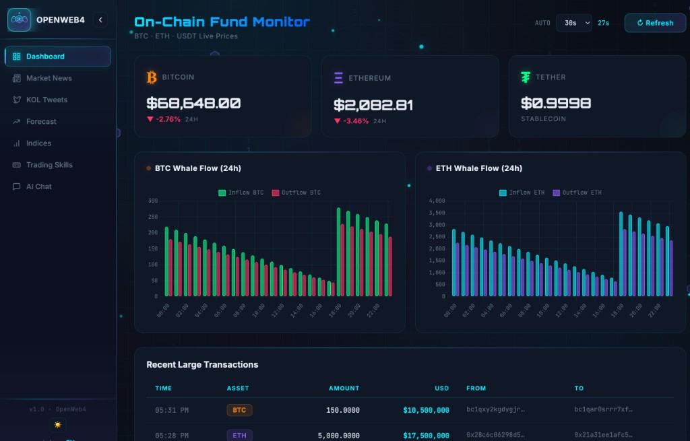

<p align="center">
  
</p>

<p align="center">
  
</p>
<p align="center"><sub>Default Web UI · English · Dashboard</sub></p>

# OpenWeb4 — Web3 AI On-Chain Monitor

**Language:** [简体中文](README.md) | English (this file)

[](LICENSE)

Spring Boot app: on-chain monitoring (BTC/ETH/USDT), crypto news, KOL tweet aggregation, market forecast & indices, AI Q&A (OpenAI-compatible streaming API). Bilingual UI (zh/en) and SPA hash routing.

## Features

- **Dashboard**: live prices, 24h change, whale flow chart, recent large transfers
- **News**: RSS (CoinDesk, CoinTelegraph), scheduled refresh, optional Chinese translation
- **KOL tweets**: Twitter/X via RSSHub / Nitter RSS, configurable handle list
- **Market forecast**: trend-oriented price or market outlook
- **Market indices**: composite indicators from multiple data sources
- **Transaction Skills**: curated comparison of exchange and third-party **Skills** for AI agent setups (not auto-trading in this repo); sidebar `#/transaction-skills`, API `GET /api/transaction-skills` (locale-aware)
- **AI chat**: browser WebSocket to this service, which calls an OpenAI-compatible API; Q&A only with input sanitization
- **SPA routes**: `#/dashboard`, `#/news`, `#/kol-tweets`, `#/market-forecast`, `#/market-indices`, `#/transaction-skills`, `#/ai-chat` without full page reload
- **Abuse & safety**: IP rate limits (refresh + chat), no debug key endpoints, Authorization not logged

## Transaction Skills

Reference page for **AI agent / OpenClaw-style** exchange and third-party **Skills** (this app does **not** execute trades). Data is manually curated from public exchange docs and similar sources, for monitoring and decision support only.

- **Exchange Skills**: Binance, OKX, Bitget, Bybit, Gate.io, Coinbase — docs links, typical `/skill install …` commands, difficulty, strengths, security notes, scope, subjective score
- **Third-party Skills**: e.g. KOL intel (XClaw), market data (CoinMarketCap), fundamentals (RootData), prediction markets (PolyClaw), yield (Almanak), contract safety (OpenZeppelin) — fit with this app and risk level
- **Safety notes** (also on the page): prefer read-only posture; never grant withdrawal permissions to AI workflows; deepen integrations only after you understand capabilities

**Open:** sidebar **Transaction Skills**, or `http://localhost:8080/transaction-skills` / `http://localhost:8080/#/transaction-skills`.

## Tech stack

- Java 17+, Spring Boot 3.3.x
- Thymeleaf, TailwindCSS, Chart.js
- i18n: `?lang=zh` / `?lang=en`
- AI: OpenAI-compatible API via `app.ai.*` / env `AI_*`

## Run

```bash
mvn spring-boot:run
```

Set AI-related environment variables before run (AI features error if unset). Java 17+ required (`java -version`).

Example (macOS/Linux):

```bash
export AI_API_KEY="YOUR_AI_API_KEY"
export APP_ALLOWED_ORIGINS="http://localhost:8080,http://127.0.0.1:8080"

# Optional: non-default provider
# export AI_BASE_URL="https://api.deepseek.com/v1"
# export AI_MODEL="deepseek-chat"
# export AI_MAX_TOKENS="1024"

mvn spring-boot:run
```

Default port **8080**. URLs:

- http://localhost:8080/
- http://localhost:8080/dashboard
- http://localhost:8080/news
- http://localhost:8080/kol-tweets
- http://localhost:8080/transaction-skills
- http://localhost:8080/ai-chat

## Configuration (production)

| Variable | Description | Default |
|----------|-------------|---------|
| `SERVER_PORT` | HTTP port | 8080 |
| `AI_API_KEY` | API key (**required in prod**, never commit) | empty |
| `AI_BASE_URL` | API root (e.g. `https://api.deepseek.com/v1`) | see `application.yml` |
| `AI_MODEL` | Model id | see `application.yml` |
| `AI_MAX_TOKENS` | Max completion tokens | 1024 |
| `APP_ALLOWED_ORIGINS` | WebSocket allowed Origins | localhost defaults |
| `APP_MAX_CHAT_MESSAGE_LENGTH` | Max chat message length | 500 |
| `APP_TWEET_HANDLES` | KOL handles, comma-separated | built-in list |
| `THYMELEAF_CACHE` | Template cache | true |

## Test

```bash
mvn test
```

## Build & production

```bash
mvn -DskipTests package
java -jar target/openweb4-1.0.0.jar
```

Set `AI_API_KEY` and `APP_ALLOWED_ORIGINS` for production. Rotate any key that was ever committed.

## License

This project is licensed under the [MIT License](LICENSE).

## Contributing & security

- See [CONTRIBUTING.md](CONTRIBUTING.md)
- See [SECURITY.md](SECURITY.md) for vulnerability reporting

## Community

Join the **openweb4** Telegram group for usage help, feature ideas, and contributor coordination:

[**https://t.me/+fK2gVWLZako2ZGFl**](https://t.me/+fK2gVWLZako2ZGFl)

Invite links are managed in Telegram; if this one expires, please open a GitHub Issue so we can refresh it.

## Acknowledgments

The **Transaction Skills** page is a compatibility-oriented reference for ecosystems such as [OpenClaw](https://github.com/openclaw/openclaw) (personal AI assistant, MIT License, skills under `skills/` and ClawHub). OpenWeb4 is an independent project; trade execution and third-party skills remain your responsibility.
