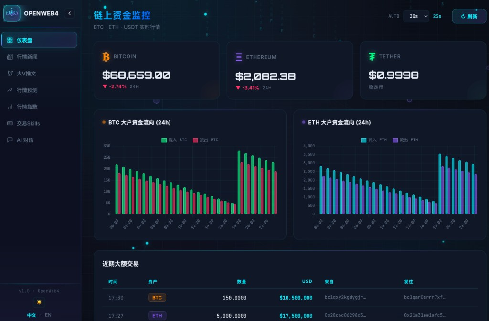

<p align="center">
  
</p>

<p align="center">
  
</p>
<p align="center"><sub>默认 Web UI：Spring Boot SPA · 中文 · 仪表盘</sub></p>

# OpenWeb4 — Web3 AI 链上监控

[](LICENSE)

**语言：** 简体中文（本页） | [English](README.en.md)

Spring Boot 应用：链上数据监控（BTC/ETH/USDT）、行情新闻、大V推文聚合、行情预测、行情指数、AI 智能问答（通过本服务调用 OpenAI 兼容流式 API）。支持中英双语界面与 SPA 单页路由体验。

## 功能

- **仪表盘**：实时价格、24h 涨跌、大户资金流向图、近期大额交易列表
- **RWA 代币化监控** 🆕：追踪真实资产代币化项目（Centrifuge、MakerDAO RWA、Ondo Finance 等），展示 TVL、抵押品类型、透明度评分
- **AI Agent 交易监控** 🆕：监控 AI 交易代理活动（OpenClaw、Virtuals Protocol、PolyStrat 等），展示 24h 交易量、成功率、策略类型
- **交易 Skills**：见下文「交易 Skills」栏目说明；侧栏进入 `#/transaction-skills`，数据由 `GET /api/transaction-skills` 提供（随界面语言中英切换）。
- **行情新闻**：RSS 抓取（CoinDesk、CoinTelegraph），定时更新，中文自动翻译
- **大V推文**：KOL Twitter 动态聚合（RSSHub / Nitter RSS），可配置账号列表
- **行情预测**：基于市场数据和趋势分析，预测未来价格走势或市场变化。
- **行情指数**：通过综合多个市场数据，反映整体行情表现的指标，常用于评估市场健康状态。
- **AI 问答**：前端通过 WebSocket 与本服务通信，本服务再调用 OpenAI 兼容流式 API（例如 DeepSeek），仅支持问答，并尽量防止命令注入
- **单页应用（SPA）**：`#/dashboard`、`#/news`、`#/kol-tweets`、`#/market-forecast`、`#/market-indices`、`#/transaction-skills`、`#/ai-chat`、`#/rwa-projects`、`#/ai-agents` 路由无整页刷新切换
- **防滥用与安全**：按 IP 限流（刷新与 AI 对话），移除调试密钥接口，日志不输出 Authorization

## 交易 Skills

面向 **AI Agent / OpenClaw 类环境** 的交易所与第三方 **Skill** 速览与对比页（非本仓库自动下单能力）。数据来自 Binance Square 与各交易所公开资料的人工整理，用于监控与决策辅助参考。

- **交易所官方 Skills**：Binance、OKX、Bitget、Bybit、Gate.io、Coinbase 等，展示官方/文档入口、典型安装命令（如 `/skill install …`）、上手难度、优势、安全要点、业务覆盖与主观评分，便于一屏横向比较。
- **第三方 Skills**：如 KOL 情报（XClaw）、市场数据（CoinMarketCap）、项目基本面（RootData）、预测市场（PolyClaw）、收益策略（Almanak）、合约安全（OpenZeppelin）等，标注能力摘要、与本站其它模块的契合度与风险等级。
- **安全提示（页面内同步展示）**：建议保持只读定位，不向 AI 工作流授予提币权限；先建立能力认知再考虑更深数据接入。

访问：侧栏 **「交易 Skills」**，或直接打开 `http://localhost:8080/transaction-skills`（与 `/dashboard` 等同返回 SPA 壳层，再由 `#/transaction-skills` 渲染内容）。

## 技术栈

- Java 17+, Spring Boot 3.3.x
- Thymeleaf, TailwindCSS, Chart.js
- 国际化：`?lang=zh` / `?lang=en`
- AI 后端：OpenAI 兼容流式 API，配置 `app.ai.*`（环境变量 `AI_*`）

## 运行

```bash
mvn spring-boot:run
```

运行前请至少配置 AI 相关环境变量（否则 AI 功能会报错提示未配置）。
请确认本地 Java 版本为 17 或更高（`java -version`）。

示例（macOS/Linux）：
```bash
export AI_API_KEY="YOUR_AI_API_KEY"
export APP_ALLOWED_ORIGINS="http://localhost:8080,http://127.0.0.1:8080"

# 可选：如果你使用的供应商不是默认的 gmn.chuangzuoli.com
# export AI_BASE_URL="https://api.deepseek.com/v1"
# export AI_MODEL="deepseek-chat"
# export AI_MAX_TOKENS="1024"

mvn spring-boot:run
```

默认端口 8080。访问：

- http://localhost:8080/
- http://localhost:8080/dashboard
- http://localhost:8080/news
- http://localhost:8080/kol-tweets
- http://localhost:8080/transaction-skills
- http://localhost:8080/ai-chat

## 配置（生产必须设置）

| 环境变量 | 说明 | 默认 |
|----------|------|------|
| `SERVER_PORT` | 服务端口 | 8080 |
| `AI_API_KEY` | AI API Key（**生产必须设置**，不要提交到仓库） | 空 |
| `AI_BASE_URL` | AI API 根地址（如 `https://api.deepseek.com/v1`，用于拼接 `/chat/completions`） | 见 `application.yml` 默认 |
| `AI_MODEL` | 模型名 | 见 `application.yml` 默认 |
| `AI_MAX_TOKENS` | 单次回复最大 token | 1024 |
| `APP_ALLOWED_ORIGINS` | WebSocket 允许的 Origin | http://127.0.0.1:8080,http://localhost:8080 |
| `APP_MAX_CHAT_MESSAGE_LENGTH` | 单条消息最大长度 | 500 |
| `APP_TWEET_HANDLES` | KOL 推特 handle 列表（逗号分隔） | elonmusk,cz_binance,VitalikButerin,CryptoHayes,saylor |
| `THYMELEAF_CACHE` | 模板缓存 | true |

## 测试

```bash
mvn test
```

## 打包与生产

```bash
mvn -DskipTests package
java -jar target/openweb4-1.0.0.jar
```

生产环境建议在启动前设置环境变量：
```bash
export AI_API_KEY="YOUR_AI_API_KEY"
export APP_ALLOWED_ORIGINS="https://your-domain.com"
export SERVER_PORT="8080"

java -jar target/openweb4-1.0.0.jar
```

生产环境务必设置 `AI_API_KEY` 和 `APP_ALLOWED_ORIGINS`；不要将密钥写入代码或提交到 Git。若仓库曾包含过密钥，应在提供商处**轮换/吊销**该密钥。

## 开源许可

本项目采用 [MIT License](LICENSE) 授权，与 [OpenClaw](https://github.com/openclaw/openclaw) 等生态常见的个人/Agent 助手项目许可方式一致；OpenWeb4 为独立仓库，与 OpenClaw 无法律隶属关系。

## 参与贡献与安全

- 贡献指南：[CONTRIBUTING.md](CONTRIBUTING.md)（中英双语）
- 漏洞披露：[SECURITY.md](SECURITY.md)（中英双语）

建议在 GitHub 仓库设置中启用 **Private vulnerability reporting**，与 `SECURITY.md` 中的流程一致。

## 社区交流

欢迎加入 Telegram 群组 **openweb4**，讨论使用问题、功能想法与协作贡献：

[**https://t.me/+fK2gVWLZako2ZGFl**](https://t.me/+fK2gVWLZako2ZGFl)

（入群链接由 Telegram 管理；若失效请开 Issue 便于更新。）
